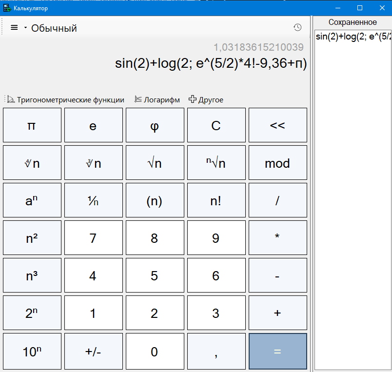

# Calculator
Классический учебный проект - калькулятор на Windows Forms.

## Что реализовано
- [x] Возможность вводить сложные выражения в поле
- [x] Валидатор на основе Regex (регулярных выражений)
- [x] Алгоритм преобразования в постфиксную форму для вычислений
- [x] Алгоритм вычисления постфиксной записи
- [x] Простой интерфейс
- [x] Расширенный функционал: тригонометрические функции, логарифмы, факториал и прочее
- [x] Сохранение введенных выражений

## Статус проекта
Проект завершён частично. Сам калькулятор готов, интерфейс сделан на минимум, чтобы показать работу с Windows Forms и C#. В меню можно найти "графики и функции" - планировалось добавить, но сейчас уже не планируется. 

## Скриншоты
  
